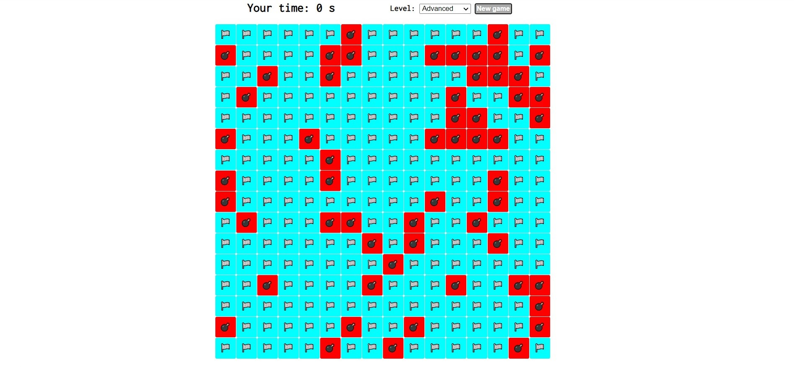

# Minesweeper

Simple ol' minesweeper

-------



Installation
------------

### Requirements

You will need [Nodejs](https://nodejs.org/en/) version >= 12.18.2 and npm version >= 6.14.5

### Setup

1. Clone this repository.

   ```sh
   git clone https://github.com/karmanya007/Minesweeper.git
   ```
2. Open this directory in the terminal and run:

   ```sh
   npm install
   npm start
   ```
3. Visit http://localhost:8080/


:smile:ENJOY:smile:
